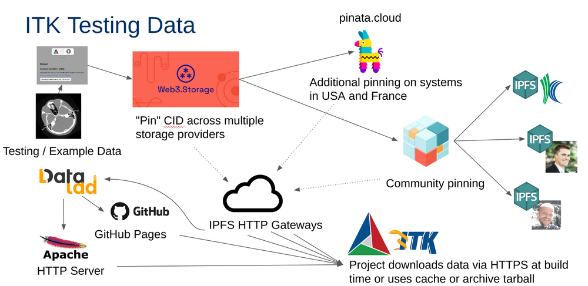

Uploading binary data in ITK
============================

Since every local [Git] repository contains a copy of the entire project
history, it is important to avoid adding large binary files directly to the
repository. Large binary files added and removed throughout a project's history
will cause the repository to become bloated, take up too much disk space,
require excessive time and bandwidth to download, etc.

A [solution to this problem] which has been adopted by ITK is to store binary
files, such as images, in a separate location outside the Git repository, then
download the files at build time with [CMake].

A "content link" file contains an identifying [Content Identifier (CID)]. The content
link is stored in the [Git] repository at the path where the file would exist,
but with a `.cid` extension appended to the file name. [CMake] will find
these content link files at **build** time, download them from a list of server
resources, and create symlinks or copies of the original files at the
corresponding location in the **build tree**.

The [Content Identifier (CID)] is a self-describing hash following the
[multiformats] standard created by the
Interplanetary Filesystem ([IPFS]) community. A file
with a CID for its filename is content-verifiable. Locating files
according to their CID makes content-addressed, as opposed to
location-addressed, data exchange possible. This practice is the
foundation of the decentralized web, also known as the dWeb or Web3. By
adopting Web3, we gain:

- **Permissionless data uploads**
- **Robust, redundant storage**
- **Local and peer-to-peer storage**
- **Scalability**
- **Sustainability**

Contributors to the ITK upload their data through a simple web app
that utilizes an easy-to-use, permissionless, free service, [web3.storage].

Data used in the ITK Git repository is periodically tracked in a
dedicated DataLad repository, the [ITKData DataLad repository].
and stored across redundant locations so it can be retrieved from any of
the following:

- Local [IPFS](https://ipfs.io/) nodes
- Peer [IPFS](https://ipfs.io/) nodes
- [web3.storage](https://web3.storage/)
- [pinata.cloud](https://pinata.cloud)
- Kitware's IPFS Server
- [ITKTestingData](https://github.com/InsightSoftwareConsortium/ITKTestingData) GitHub Pages CDN
- Kitware's Apache HTTP Server
- Local testing data cache
- Archive tarballs from GitHub Releases



*Testing data workflow. Testing or example data is uploaded to IPFS via the content-link-upload.itk.org web app.
This pins the data on multiple servers across the globe.
At release time, the data is also pinned on multiple servers in the USA and France and community pinners.
At release time, the data is also stored in the DataLad Git repository, served on an Apache HTTP server, and the GitHub Pages CDN.
At test time an ITK build can pull the data from a local cache, archive tarball, the Apache HTTP server, GitHub Pages CDN, or multiple IPFS HTTP gateways.*

See also our [Data](data.md) guide for more information. If you just
want to browse and download the ITK testing images, see the
[ITKData DataLad repository].

Adding images as input to ITK sources
-------------------------------------

ITK examples and ITK class tests (see Section 9.4 of the
[ITK Software Guide]) rely on **input** and **baseline** images (or data in
general) to demonstrate and check the features of a given class. Hence, when
developing an ITK example or test, images will need to be added to the [Git]
repository.

When using images for an ITK example or test images, the following principles
need to be followed:

  1. Images should be **small**.
     * The source tree is not an image database, but a source code repository.
     * Adding an image larger than 50 Kb should be justified by a discussion
      with the [ITK community].
  2. Regression (baseline) images should not use [Analyze format] unless the
     test is for the `AnalyzeImageIO` and related classes.
  3. Images should use non-trivial Metadata.
     * Origin should be different form zeros.
     * Spacing should be different from ones, and it should be anisotropic.
     * Direction should be different from identity.

Upload new testing data
-----------------------

### Prerequisites

[web3.storage] is a decentralized IPFS storage
provider where any ITK community member can upload binary data files.
There are two primary methods available to upload data files:

A.  The CMake ExternalData Web3 upload browser interface.
B.  The <span class="title-ref">w3</span> command line executable that
    comes with the [@web3-storage/w3cli] Node.js NPM package.

Once files have been uploaded, they will be publicly
available and accessible since data is content addressed on the IPFS
peer-to-peer network.

In addition to these two methods, documented in detail below, another
possibility includes pinning the data on IPFS with [other pinning services]
and creating the content link file manually. The content link file is simply a
plan text file with a `.cid` extension whose contents are the CID file.
However, the documented two methods are recommended due to their simplicity
and in order to keep CID values consistent.

At release time, the release manager uploads and archives repository data
references in other storage locations for additional redundancy.

### Option A) Upload Via the Web Interface

Use the [Content Link Upload]
tool ([Alt Link]) to
upload your data to the [IPFS] and download the
corresponding CMake content link file.

](./content-link-upload.png)

### Option B) Upload Via CMake and Node.js CLI

Install the <span class="title-ref">w3</span> CLI with the
[@web3-storage/w3cli] [Node.js] package:

```bash
npm install -g @web3-storage/w3cli
```

Login in with your credentials.

```bash
w3 login
```

Create an <span class="title-ref">w3externaldata</span> bash/zsh
function:

```bash
function w3externaldata() { w3 put $1 --no-wrap | tail -n 1 | awk -F "/ipfs/" '{print $2}' | tee $1.cid }
```

Call the function with the file to be uploaded. This command will
generate the <span class="title-ref">\<filename\>.cid</span> content
link:

```bash
w3externaldata <filename>
  1 file (0.3MB)
⁂ Stored 1 file
bafkreifpfhcc3gc7zo2ds3ktyyl5qrycwisyaolegp47cl27i4swxpa2ey
```

### Add the content link to the source tree

Add the file to the repository in the directory referenced by the
*CMakeLists.txt* script. Move the content link file to the **source tree** at
the location where the actual file is desired in the build tree.

Stage the new file to your commit:

```bash
git add -- path/to/file.cid
```

Next time CMake configuration runs, it will find the new content link. During
the next project build, the data file corresponding to the content link will
be downloaded into the build tree.

[Alt Link]: https://content-link-upload.itk.eth.limo
[Analyze format]: http://www.grahamwideman.com/gw/brain/analyze/formatdoc.htm
[Content Identifier (CID)]: https://docs.ipfs.tech/concepts/content-addressing/
[Content Link Upload]: https://content-link-upload.itk.org
[CONTRIBUTING.md]: ../CONTRIBUTING.md
[CMake]: https://cmake.org/
[Git]: https://git-scm.com/
[IPFS]: https://ipfs.io/
[ITKData Datalad repository]: https://gin.g-node.org/InsightSoftwareConsortium/ITKData/src/main
[ITK community]: https://discourse.itk.org/
[ITK Sphinx Examples]: https://itk.org/ITKExamples/index.html
[ITK Software Guide]: https://itk.org/ItkSoftwareGuide.pdf
[ITKTestingData]: https://github.com/InsightSoftwareConsortium/ITKTestingData
[MD5 hash]: https://en.wikipedia.org/wiki/MD5
[multiformats]: https://multiformats.io/
[Node.js]: https://nodejs.org/
[other pinning services]: https://docs.ipfs.tech/how-to/work-with-pinning-services/
[SHA512 hash]: https://en.wikipedia.org/wiki/SHA-2
[solution to this problem]: https://blog.kitware.com/cmake-externaldata-using-large-files-with-distributed-version-control/
[web3.storage]: https://web3.storage/
[@web3-storage/w3cli]: https://www.npmjs.com/package/@web3-storage/w3cli
