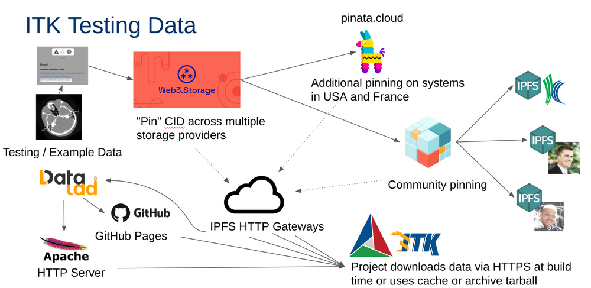

Uploading binary data in ITK
============================

Since every local [Git] repository contains a copy of the entire project
history, it is important to avoid adding large binary files directly to the
repository. Large binary files added and removed throughout a project's history
will cause the repository to become bloated, take up too much disk space,
require excessive time and bandwidth to download, etc.

A [solution to this problem] which has been adopted by ITK is to store binary
files, such as images, in a separate location outside the Git repository, then
download the files at build time with [CMake].

A "content link" file contains an identifying [Content Identifier (CID)]. The content
link is stored in the [Git] repository at the path where the file would exist,
but with a `.cid` extension appended to the file name. [CMake] will find
these content link files at **build** time, download them from a list of server
resources, and create symlinks or copies of the original files at the
corresponding location in the **build tree**.

The [Content Identifier (CID)] is a self-describing hash following the
[multiformats] standard created by the
Interplanetary Filesystem ([IPFS]) community. A file
with a CID for its filename is content-verifiable. Locating files
according to their CID makes content-addressed, as opposed to
location-addressed, data exchange possible. This practice is the
foundation of the decentralized web, also known as the dWeb or Web3. By
adopting Web3, we gain:

- **Permissionless data uploads**
- **Robust, redundant storage**
- **Local and peer-to-peer storage**
- **Scalability**
- **Sustainability**

Contributors to the ITK upload their data through a simple web app
that utilizes an easy-to-use, permissionless service, [Pinata].

Data used in the ITK Git repository is periodically tracked in a
dedicated DataLad repository, the [ITKData DataLad repository].
and stored across redundant locations so it can be retrieved from any of
the following:

Contributors upload their data by running a small shell script that pushes
the file into [IPFS] via a local [Kubo] daemon, pins it on redundant
community-run pinning services, records the resulting CID in a manifest, and
(optionally) mirrors the bytes into the [ITKTestingData] GitHub Pages
repository. See [`Utilities/Maintenance/ExternalDataUpload/README.md`] for
the one-time developer setup and full workflow.

Data referenced from the ITK Git repository is stored across redundant
locations so it can be retrieved from any of the following at build time:

- Local [Kubo] gateway (typically `127.0.0.1:8080`)
- [ITKTestingData] GitHub Pages mirror
- [Pinata] (community pinning service, remote name `itk-pinata`)
- [Filebase] (community pinning service, remote name `itk-filebase`)
- Public IPFS HTTP gateways (`ipfs.io`, `dweb.link`, `cloudflare-ipfs.com`)
- Kitware's Apache HTTP Server
- Local `ExternalData_OBJECT_STORES` cache
- Archive tarballs from GitHub Releases
- Historical [ITKData DataLad repository] snapshots (older content links)



*Testing data workflow. Testing or example data is uploaded to IPFS via the
content-link-upload.itk.org web app. New content is added with the
`Utilities/Maintenance/ExternalDataUpload/ipfs-upload.sh` script, which pushes
the bytes to a local [Kubo] node and pins them on `itk-pinata` and
`itk-filebase` for redundancy. The resulting CID is written as a `.cid`
content link in the ITK source tree and recorded in
`Testing/Data/content-links.manifest`. Files ≤ 50 MB can additionally be
mirrored into [ITKTestingData] for GitHub Pages CDN delivery. At test time an
ITK build can fetch the data from a local cache, archive tarball, the Apache
HTTP server, the GitHub Pages mirror, or any of several IPFS HTTP gateways.*

See also our [Data](data.md) guide for more information.

Adding images as input to ITK sources
-------------------------------------

ITK examples and ITK class tests (see Section 9.4 of the
[ITK Software Guide]) rely on **input** and **baseline** images (or data in
general) to demonstrate and check the features of a given class. Hence, when
developing an ITK example or test, images will need to be added to the [Git]
repository.

When using images for an ITK example or test images, the following principles
need to be followed:

  1. Images should be **small**.
     * The source tree is not an image database, but a source code repository.
     * Adding an image larger than 50 Kb should be justified by a discussion
      with the [ITK community].
  2. Regression (baseline) images should not use [Analyze format] unless the
     test is for the `AnalyzeImageIO` and related classes.
  3. Images should use non-trivial Metadata.
     * Origin should be different form zeros.
     * Spacing should be different from ones, and it should be anisotropic.
     * Direction should be different from identity.

Upload new testing data
-----------------------

### Web app

The easiest, recommended way to upload data is The [Content Link Upload] browser interface.

### CLI one-time setup

The upload workflow requires:

- A local [Kubo] daemon (CLI or IPFS Desktop) with the **UnixFS v1 2025**
  profile applied, so CIDs are reproducible across implementations
  (`ipfs config profile apply unixfs-v1-2025`, Kubo ≥ 0.40.0).
- Two remote pinning services configured under the exact names
  `itk-pinata` and `itk-filebase`. The upload script looks up these names
  and fails if they are missing.

The full step-by-step setup — installing Kubo, signing up with
[Pinata] and [Filebase], and registering each service as a remote —
is documented in
[`Utilities/Maintenance/ExternalDataUpload/README.md`]. Complete that
one-time setup before proceeding.

### Upload a file

From the ITK source tree, run the upload script with the path to the file
you want to upload:

```bash
Utilities/Maintenance/ExternalDataUpload/ipfs-upload.sh \
    Modules/.../test/Baseline/MyTest.png
```

The script will:

1. Add the file to IPFS with `--cid-version=1` under the UnixFS v1 2025
   profile, producing a deterministic CID.
2. Pin locally, then on `itk-pinata` and `itk-filebase`. By default the
   script waits until each remote reports `pinned`, which surfaces
   failures immediately but can take minutes per file as the remote
   fetches the content. For batch runs pass `--background` to submit
   pins asynchronously and verify afterwards with
   `ipfs pin remote ls --status=queued,pinning,pinned`.
3. Replace `MyTest.png` in the source tree with `MyTest.png.cid` — a
   one-line text file containing the CID.
4. Append the CID and source-tree path to
   `Testing/Data/content-links.manifest`.
5. Print the `git rm` / `git add` commands needed to stage the change.

### Mirror to ITKTestingData (optional but recommended)

Pass `--testing-data-repo <path>` to additionally copy the file into a
local clone of [ITKTestingData] at `CID/<cid>`:

```bash
Utilities/Maintenance/ExternalDataUpload/ipfs-upload.sh \
    --testing-data-repo ~/src/ITKTestingData \
    Modules/.../test/Baseline/MyTest.png
```

This populates the GitHub Pages mirror gateway
(`https://insightsoftwareconsortium.github.io/ITKTestingData/CID/<cid>`)
already listed in [`CMake/ITKExternalData.cmake`]. Commit and push in
the `ITKTestingData` repo to publish. Files larger than **50 MB** are
skipped for the mirror step only (GitHub rejects pushes containing
files over 50 MB per file) — IPFS pinning on `itk-pinata` and
`itk-filebase` still proceeds for those files.

### Alternative: upload via the web app

Contributors who prefer not to run a local [Kubo] daemon can upload a file
through the [Content Link Upload] web app ([Alt Link]). The app pins the
file on [web3.storage] and returns the corresponding `.cid` content link
to download. The resulting CID is usable anywhere the script-produced CID
would be — but the manifest entry and the optional [ITKTestingData]
mirror must then be added by hand. The script-based workflow above is
preferred when available because it also updates
`Testing/Data/content-links.manifest` and pins on the ITK community
services in one step.

### Normalize existing content links

Older `.md5` / `.sha256` / `.sha512` content links can be converted to
`.cid`, and existing `.cid` links can be regenerated under the UnixFS
v1 2025 profile, with:

```bash
Utilities/Maintenance/ExternalDataUpload/content-link-normalize.sh <path-or-file>
```

See [`Utilities/Maintenance/ExternalDataUpload/README.md`] for the full
set of options (`--dry-run`, `--hash-only`, `--cid-only`, `--background`,
`--testing-data-repo`).

### Add the content link to the source tree

The upload script prints the exact commands to stage:

```bash
git add path/to/MyTest.png.cid
git add Testing/Data/content-links.manifest
git commit
```

Next time CMake configuration runs, it will find the new content link.
During the next project build, the data file corresponding to the
content link will be downloaded into the build tree from the first
reachable gateway in [`CMake/ITKExternalData.cmake`].

[Alt Link]: https://content-link-upload.itk.eth.limo
[Analyze format]: http://www.grahamwideman.com/gw/brain/analyze/formatdoc.htm
[Content Identifier (CID)]: https://docs.ipfs.tech/concepts/content-addressing/
[Content Link Upload]: https://content-link-upload.itk.org
[CONTRIBUTING.md]: ../CONTRIBUTING.md
[CMake]: https://cmake.org/
[`CMake/ITKExternalData.cmake`]: https://github.com/InsightSoftwareConsortium/ITK/blob/main/CMake/ITKExternalData.cmake
[Filebase]: https://filebase.com/
[Git]: https://git-scm.com/
[IPFS]: https://ipfs.io/
[ITK community]: https://discourse.itk.org/
[ITK Sphinx Examples]: https://itk.org/ITKExamples/index.html
[ITK Software Guide]: https://itk.org/ItkSoftwareGuide.pdf
[ITKData DataLad repository]: https://gin.g-node.org/InsightSoftwareConsortium/ITKData/src/main
[ITKTestingData]: https://github.com/InsightSoftwareConsortium/ITKTestingData
[Kubo]: https://github.com/ipfs/kubo
[multiformats]: https://multiformats.io/
[Pinata]: https://pinata.cloud/
[solution to this problem]: https://blog.kitware.com/cmake-externaldata-using-large-files-with-distributed-version-control/
[`Utilities/Maintenance/ExternalDataUpload/README.md`]: https://github.com/InsightSoftwareConsortium/ITK/blob/main/Utilities/Maintenance/ExternalDataUpload/README.md
